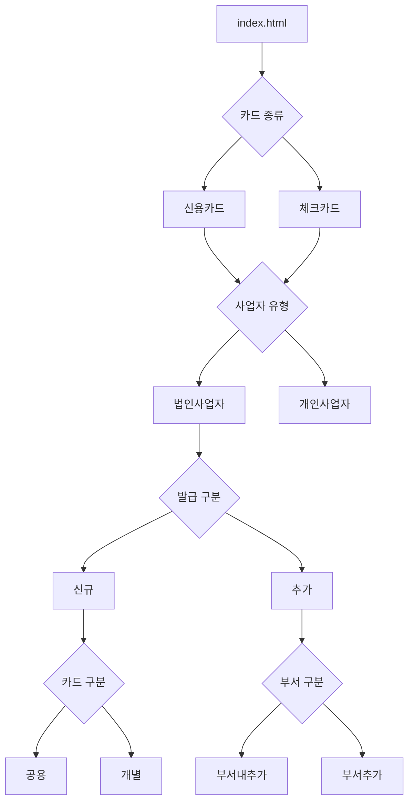

# KB 기업카드 비대면 신청 목업 — 아키텍처 설명서

**문서 버전**: v2.0 (2026-02-20)  
**대상 독자**: 개발자, 기획자, QA 담당자

---

## 1. 목적 (Purpose)

이 프로젝트는 KB국민카드 기업카드(신용/체크) 비대면 신청 프로세스를 **브라우저에서 실행되는 HTML 목업**으로 구현한 것입니다.  
실제 서버 없이 `localStorage` 기반 가상 DB와 공통 JS 엔진으로 **완전한 사용자 여정을 시뮬레이션**할 수 있습니다.

---

## 2. 전체 구조 (Directory Layout)

```
card_mockup/
│
├── index.html                 ← 진입점: 모드 선택 (통합형 / 일반형)
├── integrated_flow.html       ← 통합 시나리오 런처
├── general_flow.html          ← 시나리오 직접 선택 런처
├── session-summary.html       ← 신청 완료 요약 화면
│
├── 0001_r.html ~ 0074_r.html ← 개별 화면 73개 (0056 결번)
│
├── css/
│   ├── kb-theme.css           ← KB 디자인 토큰 + 전체 컴포넌트
│   └── common.css             ← Toast, Modal, Spec-Table 패턴
│
├── js/
│   ├── scenario-nav.js        ← 핵심: 라우팅 엔진 + 세션 복구
│   ├── session-db.js          ← 핵심: localStorage 가상 DB
│   ├── common.js              ← 공통 유틸 (Toast, Modal 헬퍼)
│   └── spec-viewer.js         ← 요건정의서 뷰어 팝업
│
├── mock_db/                   ← 가상 백엔드 데이터 (JSON)
│   ├── member_ledger.json     ← 회원원장 (사업자번호 기준)
│   ├── customer_ledger.json   ← 고객원장 (주민번호 기준)
│   └── application_ledger.json← 신청서접수원장
│
├── docs/
│   ├── ARCHITECTURE.md        ← 이 문서
│   ├── scenarios/             ← 4개 시나리오 정의서
│   ├── branches/              ← 분기 흐름 정의서
│   └── screens/               ← 73개 화면별 요건 정의서
│
└── scripts/                   ← 개발 유틸리티 (Python/JS)
    ├── check_screen_ids.py
    ├── extract_specs.py
    └── ... (16개)
```

---

## 3. 계층 구조 (Layer Diagram)

```
┌──────────────────────────────────────────────────────┐
│                  Presentation Layer                  │
│  0001_r.html ~ 0074_r.html  (73개 개별 화면)          │
│  css/kb-theme.css   css/common.css                   │
└────────────────────────┬─────────────────────────────┘
                         │ ScenarioNav API 호출
┌────────────────────────▼─────────────────────────────┐
│                  Navigation Engine                   │
│  js/scenario-nav.js                                  │
│  ┌──────────────┐  ┌──────────────┐  ┌────────────┐  │
│  │ SCENARIOS    │  │ screenFile() │  │  goNext()  │  │
│  │ (시나리오맵) │  │ (파일명변환)  │  │  goPrev()  │  │
│  └──────────────┘  └──────────────┘  └────────────┘  │
│  ┌──────────────────────────────────────────────────┐ │
│  │   Navigation Bar Injection (상단 진행 표시줄)     │ │
│  │   Recovery Modal (세션 이어가기/새로시작)         │ │
│  └──────────────────────────────────────────────────┘ │
└────────────────────────┬─────────────────────────────┘
                         │ SessionDB API 호출
┌────────────────────────▼─────────────────────────────┐
│                   Session / Data Layer               │
│  js/session-db.js                                    │
│  ┌────────────┐  ┌────────────┐  ┌────────────────┐  │
│  │  init()    │  │  save()    │  │  logAction()   │  │
│  │ (세션생성)  │  │ (화면저장) │  │  (이벤트로그)  │  │
│  └────────────┘  └────────────┘  └────────────────┘  │
│  ┌──────────────────────────────────────────────────┐ │
│  │   localStorage (kb_sess_*, kb_ledger_*)          │ │
│  └──────────────────────────────────────────────────┘ │
└──────────────────────────────────────────────────────┘
```

---

## 4. 핵심 모듈 상세 (Core Modules)

### 4-1. `scenario-nav.js` — 라우팅 엔진

**역할**: 화면 간 이동 제어, 세션 파라미터 유지, 복구 UI 제공

**주요 구성:**

| 함수/객체 | 설명 |
|---|---|
| `SCENARIOS` | 전체 시나리오 경로 맵 (JSON 형태) |
| `screenFile(id)` | 화면 ID → 파일명 변환 (e.g. `0001` → `0001_r.html`) |
| `getParams()` | URL에서 `session`, `scenario`, `step` 파라미터 추출 |
| `goNext()` | 다음 화면으로 이동 + SessionDB 저장 트리거 |
| `goPrev()` | 이전 화면으로 이동 |
| `init()` | 페이지 로드 시 실행: 복구 감지 → 내비게이션 바 주입 |
| `showRecoveryDialog()` | 이전 세션 감지 시 이어가기/새로시작 모달 표시 |
| `continueInit()` | 복구 판단 후 실제 초기화 진행 |
| `injectParams()` | 하드코딩된 URL에 세션 파라미터 자동 주입 (인터셉터) |
| `window._KB_SWITCH_SCENARIO()` | 시나리오 동적 전환 (e.g. 신규→추가) |

**URL 파라미터 구조:**

```
https://localhost:8080/0010_r.html
  ?session=20260220-abc123   ← 현재 세션 ID
  &scenario=법사신용신규공용   ← 시나리오 코드
  &step=9                    ← 현재 화면 인덱스
```

---

### 4-2. `session-db.js` — 가상 DB

**역할**: 화면 입력값과 사용자 행동 이력을 `localStorage`에 영속 저장

**데이터 구조:**

```json
{
  "sessionId": "20260220-abc123",
  "scenarioCode": "법사신용신규공용",
  "scenarioLabel": "법인사업자 신용카드 신규 (공용)",
  "status": "in_progress",
  "createdAt": "2026-02-20T09:00:00.000Z",
  "updatedAt": "2026-02-20T09:15:00.000Z",
  "currentStep": 9,
  "screens": {
    "0001": { "bizNo": "1234567890" },
    "0010": { "applicantName": "홍길동" }
  },
  "logs": [
    { "timestamp": "...", "screenId": "0001", "action": "NEXT_CLICK", "data": {} }
  ]
}
```

**주요 API:**

| 함수 | 설명 |
|---|---|
| `SessionDB.init(scenarioCode)` | 새 세션 생성 및 ID 발급 |
| `SessionDB.save(screenId, data)` | 현재 화면 입력값 저장 |
| `SessionDB.get(sessionId)` | 세션 전체 조회 |
| `SessionDB.logAction(screenId, action, data)` | 사용자 이벤트 로깅 |
| `SessionDB.complete()` | 세션 완료 처리 + Application Ledger 생성 |
| `SessionDB.currentId()` | 현재 활성 세션 ID 조회 |

---

## 5. 시나리오 계층 (Scenario Tree)

24개의 기존 AS-IS 시나리오를 **4단계 트리**로 통합합니다.



시나리오 코드 예시:
- `법사신용신규공용` → 법인 신용 신규 공용 카드
- `법사체크추가개별_부서내` → 법인 체크 추가 개별 카드 (부서내)
- `개사신용` → 개인사업자 신용카드

---

## 6. 흐름도 (User Flow)

```
[index.html]
     │
     ├──→ [general_flow.html]   : 시나리오 직접 선택
     │         │
     │         └──→ 0001_r.html?session=X&scenario=Y&step=0
     │
     └──→ [integrated_flow.html]: 조건 입력 → 자동 분기
               │
               └──→ 사업자번호 입력 → 신규/추가 판별 → 해당 시나리오 시작

[각 화면 XXX_r.html]
     │
     ├── ScenarioNav 초기화 (URL 파라미터 파싱)
     ├── SessionDB에서 이전 입력값 불러오기
     ├── 상단 내비게이션 바 자동 주입
     ├── 사용자 입력 및 검증
     ├── [다음] 버튼 → ScenarioNav.goNext()
     │         └── SessionDB.save() → URL 이동
     └── [이전] 버튼 → ScenarioNav.goPrev()

[신청 완료 화면]
     │
     └── SessionDB.complete() → Application Ledger 생성
               └──→ session-summary.html
```

---

## 7. 세션 복구 메커니즘

브라우저를 새로고침하거나 실수로 탭을 닫아도 세션이 보존됩니다.

```
페이지 로드
     │
     ▼
URL에 ?session= 파라미터가 있는가?
     │
     ├─ YES → continueInit() → 정상 시나리오 진입
     │
     └─ NO  → SessionDB.currentId() 조회
                   │
                   ├─ 이전 세션 없음 → 일반 화면 표시
                   │
                   └─ 이전 세션 있음 (status: 'in_progress')
                               │
                               ▼
                     ┌──────────────────┐
                     │  복구 선택 모달  │
                     │                  │
                     │ [이어가기]       │
                     │ [새로 시작]      │
                     └──────────────────┘
                               │
                  ┌────────────┴────────────┐
                  ▼                         ▼
         마지막 step으로 이동         세션 초기화
```

---

## 8. CSS 아키텍처

**2단계 CSS 구조:**

```
css/kb-theme.css     ← Layer 1: 디자인 토큰 + 전체 컴포넌트
css/common.css       ← Layer 2: 반복 UI 패턴 (Toast, Modal, Spec)
<style> (인라인)     ← Layer 3: 화면 전용 스타일 (최소화 지향)
```

**로드 순서 (모든 화면):**

```html
<link rel="stylesheet" href="css/kb-theme.css" />
<link rel="stylesheet" href="css/common.css" />
<style>/* 화면 전용 스타일만 */</style>
```

---

## 9. 상태 관리 흐름 (State Management)

```
화면 입력 (Form)
     │
     ▼
SessionDB.save('XXXX', { key: value })
     │
     └──→ localStorage['kb_sess_<sessionId>']
               │
               └──→ 다음 화면에서
                    SessionDB.get(sessionId).screens['XXXX']
                    로 이전 입력값 복원
```

---

## 10. 개발 시 참고사항

### 새 화면 추가 방법
1. 기존 화면 HTML 복사 후 `SCREEN_ID` 상수 수정
2. `js/scenario-nav.js` 내 `SCENARIOS` 객체에 해당 ID 추가
3. `docs/screens/` 하위에 요건정의서 작성

### 디버깅
- 브라우저 콘솔: `[ScenarioNav]`, `[SessionDB:Log]` 태그로 필터
- `localStorage` 직접 조회: `JSON.parse(localStorage.getItem('kb_sess_<ID>'))`

### 주의사항
- HTML 파일명 형식: `XXXX_r.html` (숫자 4자리 + `_r` + `.html` 소문자)
- 시나리오 전환(`_KB_SWITCH_SCENARIO`) 호출 시 기존 세션 데이터는 유지됨
- `general_flow.html`과 `integrated_flow.html`은 진입 방식이 다르나 이후 화면은 동일 경로 사용
