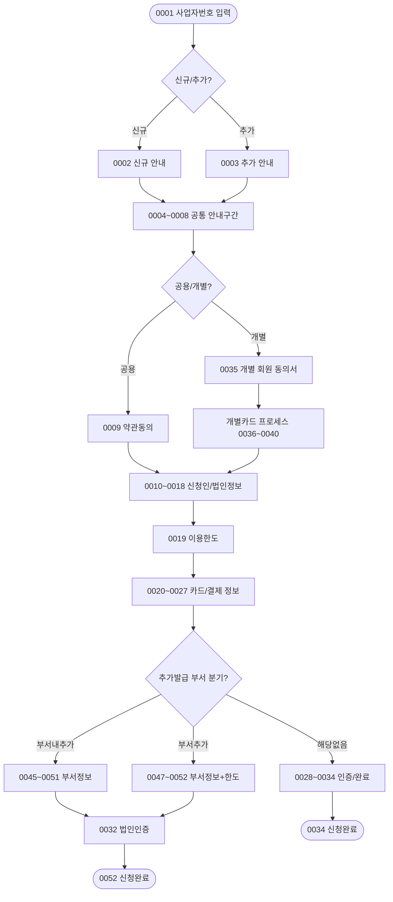

# 시나리오 01: 신용카드 × 법인사업자 (법사자_신용)

> **목적:** KB국민카드 기업 신용카드를 법인사업자가 비대면으로 신청하는 전체 흐름을 정의합니다.

---

## 분기 구조 개요

```
0001 사업자번호 입력
  └─ 조회결과
       ├─ [신규] → 0002 신규 안내
       └─ [추가] → 0003 추가 안내
            │
            ▼ (공통: 0004~0008)
            │
       ├─ [공용카드] → 신용_신규_공용 또는 신용_추가_공용
       └─ [개별카드] → 신용_신규_개별 또는 신용_추가_개별
                                  │
                       (추가발급인 경우)
                       ├─ [부서내추가발급]
                       └─ [부서추가]
```

---

## 분기별 상세 흐름

### 1. 신용_신규_공용 (Branch: `SC-01-A`)

> 파일: [branches/SC-01-A_신용_신규_공용.md](../branches/SC-01-A_신용_신규_공용.md)

| 순서 | 화면ID | 화면명 | 분기여부 |
|------|--------|--------|----------|
| 1 | [0001](../screens/0001_사업자번호입력.md) | 사업자번호 입력 | 공통 |
| 2 | [0002](../screens/0002_신규_대상_통합_발급_안내.md) | 신규 대상 통합 발급 안내 | 신규 |
| 3 | [0004](../screens/0004_준비사항.md) | 준비사항 | |
| 4 | [0005](../screens/0005_제출서류.md) | 제출서류 | |
| 5 | [0006](../screens/0006_서류자동제출서비스.md) | 서류자동제출서비스 | |
| 6 | [0007](../screens/0007_유의사항.md) | 유의사항 | |
| 7 | [0008](../screens/0008_법인_공동인증서_기업용_이용안내.md) | 법인 공동인증서(기업용)이용안내 | **공용 분기** |
| 8 | [0009](../screens/0009_신용카드_상품_약관동의.md) | 신용카드 상품 약관동의 | |
| 9 | [0010](../screens/0010_신청인정보.md) | 신청인정보 | |
| 10 | [0011](../screens/0011_신청자_신용정보_조회_이용_동의.md) | 신청자 신용정보 조회 이용 동의 | |
| 11 | [0012](../screens/0012_신청인_본인인증.md) | 신청인 본인인증 | |
| 12 | [0013](../screens/0013_신청인_CDD_조건부_검증.md) | 신청인 CDD 조건부 검증 | 조건부 |
| 13 | [0014](../screens/0014_대표자_정보.md) | 대표자 정보 | |
| 14 | [0015](../screens/0015_사업자_정보.md) | 사업자 정보 | |
| 15 | [0016](../screens/0016_법인_정보.md) | 법인 정보 | |
| 16 | [0017](../screens/0017_EDD정보.md) | EDD정보 | |
| 17 | [0018](../screens/0018_필수확인사항.md) | 필수확인사항 | |
| 18 | [0019](../screens/0019_이용한도.md) | 이용한도 | |
| 19 | [0020](../screens/0020_명세서_받으실_곳.md) | 명세서 받으실 곳 | |
| 20 | [0021](../screens/0021_카드선택.md) | 카드선택 | |
| 21 | [0022](../screens/0022_결제일.md) | 결제일 | |
| 22 | [0023](../screens/0023_결제계좌.md) | 결제계좌 | |
| 23 | [0024](../screens/0024_신청매수.md) | 신청매수 | |
| 24 | [0025](../screens/0025_발급_확인_및_약관수령.md) | 발급 확인 및 약관수령 | |
| 25 | [0026](../screens/0026_카드수령지.md) | 카드수령지 | |
| 26 | [0027](../screens/0027_추천인.md) | 추천인 | |
| 27 | [0028](../screens/0028_공동인증서_인증.md) | 공동인증서 인증 | |
| 28 | [0029](../screens/0029_카드정보_확인용_.md) | 카드정보(확인용) | |
| 29 | [0030](../screens/0030_사업자정보_확인용_.md) | 사업자정보(확인용) | |
| 30 | [0031](../screens/0031_대표자정보_확인용_.md) | 대표자정보(확인용) | |
| 31 | [0032](../screens/0032_법인인증.md) | 법인인증 | |
| 32 | [0033](../screens/0033_추가서류제출.md) | 추가서류제출 | |
| 33 | [0034](../screens/0034_신청완료.md) | 신청완료 | ✅ 종료 |

### 2. 신용_신규_개별 (Branch: `SC-01-B`)

> 파일: [branches/SC-01-B_신용_신규_개별.md](../branches/SC-01-B_신용_신규_개별.md)

| 순서 | 화면ID | 화면명 | 분기여부 |
|------|--------|--------|----------|
| 1~7 | 0001→0008 | (공통구간 동일) | |
| 8 | [0035](../screens/0035_개별_카드_회원_동의서_작성안내.md) | 개별 카드 회원 동의서 작성안내 | **개별 분기** |
| 9 | [0036](../screens/0036_개별카드_사용자_개인명의계좌_등록.md) | 개별카드 사용자 개인명의계좌 등록 | |
| 10 | [0037](../screens/0037_개별카드_발급_대상_고객_정보.md) | 개별카드 발급 대상 고객 정보 | |
| 11 | [0038](../screens/0038_개별카드_동의_조회_조회하기_.md) | 개별카드 동의 조회(조회하기) | |
| 12 | [0039](../screens/0039_개인신용정보_동의서.md) | 개인신용정보 동의서 | |
| 13 | [0040](../screens/0040_개별카드_동의_조회_신청하기_.md) | 개별카드 동의 조회(신청하기) | |
| 14~끝 | 0010→0034 | (공통 구간 합류) | |

### 3. 신용_추가_공용_부서내추가 (Branch: `SC-01-C`)

> 파일: [branches/SC-01-C_신용_추가_공용_부서내추가.md](../branches/SC-01-C_신용_추가_공용_부서내추가.md)

| 순서 | 화면ID | 화면명 | 분기여부 |
|------|--------|--------|----------|
| 1 | [0001](../screens/0001_사업자번호입력.md) | 사업자번호 입력 | |
| 2 | [0003](../screens/0003_추가_대상_통합_발급_안내.md) | 추가 대상 통합 발급 안내 | 추가 |
| 3 | [0004](../screens/0004_준비사항.md)~[0008](../screens/0008_법인_공동인증서_기업용_이용안내.md) | 공통구간 | |
| 4 | [0010](../screens/0010_신청인정보.md) | 신청인정보 | |
| 5 | [0011](../screens/0011_신청자_신용정보_조회_이용_동의.md) | 신용정보 조회 동의 | |
| 6 | [0012](../screens/0012_신청인_본인인증.md) | 신청인 본인인증 | |
| 7 | [0013](../screens/0013_신청인_CDD_조건부_검증.md) | CDD 조건부 검증 | |
| 8 | [0018](../screens/0018_필수확인사항.md) | 필수확인사항 | |
| 9 | [0045](../screens/0045_기본정보.md) | 기본정보 | |
| 10 | [0021](../screens/0021_카드선택.md)~[0029](../screens/0029_카드정보_확인용_.md) | 카드정보 입력 | |
| 11 | [0042](../screens/0042_법인_EDD정보.md) | 법인 EDD정보 | |
| 12 | [0027](../screens/0027_추천인.md)~[0028](../screens/0028_공동인증서_인증.md) | 추천인/인증 | |
| 13 | [0051](../screens/0051_업체_부서_정보_확인용_.md) | 업체(부서)정보(확인용) | |
| 14 | [0032](../screens/0032_법인인증.md) | 법인인증 | |
| 15 | [0052](../screens/0052_신청완료_카드신청정보_확인용_.md) | 신청완료_카드신청정보(확인용) | ✅ 종료 |

### 4. 신용_추가_공용_부서추가 (Branch: `SC-01-D`)

> 파일: [branches/SC-01-D_신용_추가_공용_부서추가.md](../branches/SC-01-D_신용_추가_공용_부서추가.md)

SC-01-C와 유사하나, 0048(업체부서정보) → 0050(부서별한도) 화면이 추가됩니다.

| 추가 화면 | 화면ID | 화면명 |
|-----------|--------|--------|
| (SC-01-C 대비 추가) | [0047](../screens/0047_대표자_사업자정보.md) | 대표자_사업자정보 |
| | [0048](../screens/0048_업체_부서_정보.md) | 업체(부서)정보 |
| | [0050](../screens/0050_부서별한도_요청한도_입력_.md) | 부서별한도(요청한도 입력) |

---

## 화면 ID 검증 결과

| 상태 | 화면 목록 |
|------|----------|
| ✅ ID 일치 | 0001, 0002, 0012~0027, 0031~0032, 0037~0052 등 |
| ⚠️ SCREEN_ID 미정의 | 0003~0011, 0028~0030, 0033~0036, 0058, 0063 |
| ❌ 불일치 | **0038** (파일명=0038, 내부ID=0039) |

> 0038_r.html 내부에 SCREEN_ID가 0039로 잘못 기재되어 있습니다. 수정이 필요합니다.

---

## 시나리오 적용 흐름도


