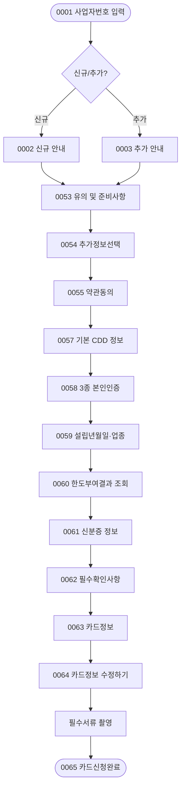

# 시나리오 02: 신용카드 × 개인사업자 (개사자_신용)

> **목적:** KB국민카드 기업 신용카드를 개인사업자(개사자)가 비대면으로 신청하는 전체 흐름을 정의합니다.  
> 법인사업자와 달리, **개사자 전용 화면(0053~0065)** 을 사용합니다.

---

## 분기 구조 개요

```
0001 사업자번호 입력
  └─ 조회결과
       ├─ [신규] → 0002 신규 안내 → 개사자_신용 전용 흐름
       └─ [추가] → 0003 추가 안내 → 개사자_신용 전용 흐름
```

> 개인사업자 신용카드는 공용/개별 분기가 없습니다. 단일 흐름으로 진행됩니다.

---

## 화면 흐름

### 신용_개사자_신규 / 신용_개사자_추가 (Branch: `SC-02-A` / `SC-02-B`)

| 순서 | 화면ID | 화면명 | 비고 |
|------|--------|--------|------|
| 1 | [0001](../screens/0001_사업자번호입력.md) | 사업자번호 입력 | 공통 시작 |
| 2 | [0002](../screens/0002_신규_대상_통합_발급_안내.md) / [0003](../screens/0003_추가_대상_통합_발급_안내.md) | 신규/추가 안내 | 신규↔추가 분기 |
| 3 | [0053](../screens/0053_유의_및_준비사항_개사자_신용_.md) | 유의 및 준비사항(개사자_신용) | 개사자 전용 |
| 4 | [0054](../screens/0054_추가정보선택_개사자전용_.md) | 추가정보선택(개사자전용) | 후불교통카드 선택 |
| 5 | [0055](../screens/0055_약관동의_신용_or_체크_.md) | 약관동의(신용 or 체크) | |
| 6 | [0057](../screens/0057_카드신청_기본_CDD_개사자전용_.md) | 카드신청 기본_CDD(개사자전용) | CDD 정보 수집 |
| 7 | [0058](../screens/0058_3종_본인인증_개사자_신용_체크_.md) | 3종 본인인증(개사자_신용_체크) | 휴대폰/카드/공동인증서 |
| 8 | [0059](../screens/0059_설립년월일_업종분류_개사자전용_.md) | 설립년월일_업종분류(개사자전용) | 희망한도 포함 |
| 9 | [0060](../screens/0060_한도부여결과조회_개사자전용_.md) | 한도부여결과조회(개사자전용) | 심사 결과 안내 |
| 10 | [0061](../screens/0061_신분증_정보_개사자전용_.md) | 신분증 정보(개사자전용) | 주민등록증/운전면허증 |
| 11 | [0062](../screens/0062_필수확인사항_개사자전용_.md) | 필수확인사항(개사자전용) | 연간소득, 결제일 |
| 12 | [0063](../screens/0063_카드정보_개사자전용_.md) | 카드정보(개사자전용) | 종합 입력 화면 |
| 13 | [0064](../screens/0064_카드정보수정하기_개사자전용_.md) | 카드정보수정하기(개사자전용) | 검토/수정 |
| 14 | *(필수서류 촬영)* | 필수 항목 촬영(이미지 접수) | 파일 미존재 (별도 처리) |
| 15 | [0065](../screens/0065_카드신청완료_개사자전용_.md) | 카드신청완료(개사자전용) | ✅ 종료 |

---

## 0056 화면 부재 안내

> `0056`번 화면은 **의도적으로 제외**된 번호입니다. 파일이 존재하지 않으며 정상입니다.

---

## 법사자_신용 대비 주요 차이점

| 항목 | 법인사업자(법사자_신용) | 개인사업자(개사자_신용) |
|------|------------------------|------------------------|
| 법인정보 입력 | ✅ 필요 (0016) | ❌ 해당 없음 |
| EDD 정보 | ✅ 필요 (0017) | ❌ 해당 없음 |
| 한도부여결과 조회 | ❌ 해당 없음 | ✅ 필요 (0060) |
| 신분증 진위 확인 | ❌ 해당 없음 | ✅ 필요 (0061) |
| 공용/개별 분기 | ✅ 있음 | ❌ 없음 |
| 부서내추가/부서추가 분기 | ✅ 있음 | ❌ 없음 |
| CDD 수집 | 0013 (조건부) | 0057 (필수) |
| 완료 화면 | 0034 또는 0052 | 0065 |

---

## 흐름도


