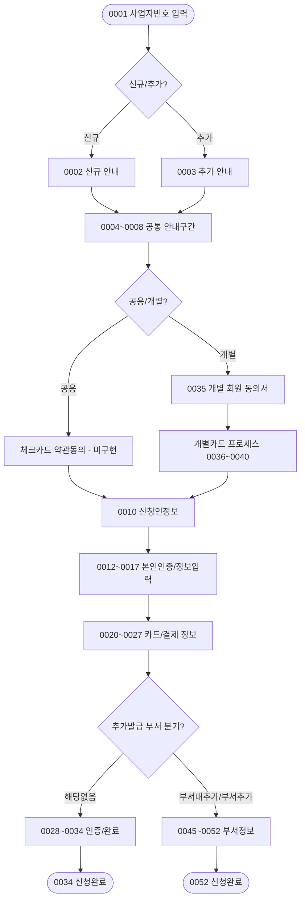

# 시나리오 03: 체크카드 × 법인사업자 (법사자_체크)

> **목적:** KB국민카드 기업 체크카드를 법인사업자가 비대면으로 신청하는 전체 흐름을 정의합니다.  
> `법사자_신용`과 화면 구조가 유사하며, **신용정보 조회(0011)는 신용카드와 동일하게 진행**됩니다.
> 단, 신용카드 전용 화면(0018, 0019, 0022 등)은 제외됩니다.

---

## 분기 구조 개요

```
0001 사업자번호 입력
  └─ 조회결과
       ├─ [신규] → 0002 신규 안내
       └─ [추가] → 0003 추가 안내
            │
            ▼ (공통: 0004~0008)
            │
       ├─ [공용카드] → 체크_신규_공용 또는 체크_추가_공용
       └─ [개별카드] → 체크_신규_개별 또는 체크_추가_개별
```

---

## 법사자_신용 대비 주요 차이점

| 항목 | 법인사업자_신용 | 법인사업자_체크 |
|------|----------------|----------------|
| 신용카드 약관동의 (0009) | ✅ 있음 | ❌ → 체크카드 약관동의 (#N/A) |
| 신용정보 조회 동의 (0011) | ✅ 있음 | ✅ 있음 (동일함) |
| 개인신용정보 동의서 (0039) | ✅ 있음 | ✅ 있음 (동일함) |
| 이용한도 (0019) | ✅ 있음 | ❌ 해당 없음 |
| 신청완료 화면 | 0034 또는 0052 | 0034 또는 0052 (동일) |

> ⚠️ `#N/A` 표시된 체크카드 전용 약관 화면은 아직 HTML 파일로 구현되지 않았습니다.

---

## 화면 흐름 (체크_신규_공용 기준, Branch: `SC-03-A`)

| 순서 | 화면ID | 화면명 | 비고 |
|------|--------|--------|------|
| 1 | [0001](../screens/0001_사업자번호입력.md) | 사업자번호 입력 | |
| 2 | [0002](../screens/0002_신규_대상_통합_발급_안내.md) | 신규 대상 통합 발급 안내 | |
| 3 | [0004](../screens/0004_준비사항.md)~[0008](../screens/0008_법인_공동인증서_기업용_이용안내.md) | 준비사항~법인인증서 안내 | |
| 4 | *(체크카드 약관동의)* | 체크카드 상품 약관동의 | **HTML 미존재** |
| 5 | [0010](../screens/0010_신청인정보.md) | 신청인정보 | |
| 6 | [0011](../screens/0011_신청자_신용정보_조회_이용_동의.md) | 신청자 신용정보 조회 이용 동의 | **신용과 동일** |
| 7 | [0012](../screens/0012_신청인_본인인증.md) | 신청인 본인인증 | |
| 8 | [0013](../screens/0013_신청인_CDD_조건부_검증.md) | 신청인 CDD 조건부 검증 | |
| 9 | [0014](../screens/0014_대표자_정보.md) | 대표자 정보 | |
| 10 | [0015](../screens/0015_사업자_정보.md) | 사업자 정보 | |
| 11 | [0016](../screens/0016_법인_정보.md) | 법인 정보 | |
| 12 | [0017](../screens/0017_EDD정보.md) | EDD정보 | |
| 13 | [0020](../screens/0020_명세서_받으실_곳.md) | 명세서 받으실 곳 | *(0019 이용한도 없음)* |
| 14 | [0021](../screens/0021_카드선택.md)~[0027](../screens/0027_추천인.md) | 카드/결제/수령지/추천인 | |
| 15 | [0028](../screens/0028_공동인증서_인증.md) | 공동인증서 인증 | |
| 16 | [0029](../screens/0029_카드정보_확인용_.md)~[0031](../screens/0031_대표자정보_확인용_.md) | 각종 확인용 화면 | |
| 17 | [0032](../screens/0032_법인인증.md) | 법인인증 | |
| 18 | [0033](../screens/0033_추가서류제출.md) | 추가서류제출 | |
| 19 | [0034](../screens/0034_신청완료.md) | 신청완료 | ✅ 종료 |

---

## 흐름도


