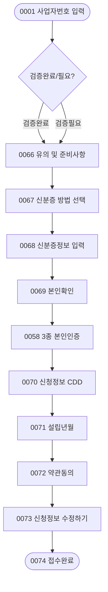

# 시나리오 04: 체크카드 × 개인사업자 (개사자_체크)

> **목적:** KB국민카드 기업 체크카드를 개인사업자(개사자)가 비대면으로 신청하는 전체 흐름을 정의합니다.  
> 4가지 시나리오 중 **가장 짧은 흐름**이며, 체크카드 전용 신분증 진위확인 프로세스가 특징입니다.

---

## 분기 구조 개요

```
0001 사업자번호 입력
  └─ 조회결과
       ├─ [신규_검증완료] → 체크_신규(검증완료)
       └─ [신규_검증필요] → 체크_신규(검증필요)
```

> 개사자_체크는 신규 분기만 존재합니다 (추가발급 시나리오 현재 미확보).

---

## 화면 흐름

### 체크_개사자_신규 (Branch: `SC-04-A` 검증완료 / `SC-04-B` 검증필요)

| 순서 | 화면ID | 화면명 | 비고 |
|------|--------|--------|------|
| 1 | [0001](../screens/0001_사업자번호입력.md) | 사업자번호 입력 | 공통 시작 |
| 2 | *(약관동의)* | *(없음 또는 미정)* | 검증완료 분기는 이 단계 없음 |
| 3 | [0066](../screens/0066_유의_및_준비사항_개사_체크전용_.md) | 유의 및 준비사항(개사_체크전용) | 체크 전용 |
| 4 | [0067](../screens/0067_신분증진위확인_촬영또는직접입력선택.md) | 신분증진위확인 방법 선택 | 촬영 or 직접입력 |
| 5 | [0068](../screens/0068_신분증정보_입력_개사_체크_.md) | 신분증정보 입력(개사 체크) | 주민등록증/운전면허증 |
| 6 | [0069](../screens/0069_본인확인_개사_체크_.md) | 본인확인(개사_체크) | 이전 세션 정보 확인 |
| 7 | [0058](../screens/0058_3종_본인인증_개사자_신용_체크_.md) | 3종 본인인증(개사자_신용_체크) | 공용 (신용과 동일) |
| 8 | [0070](../screens/0070_신청정보_CDD_개사_체크_.md) | 신청정보_CDD(개사_체크) | 카드종류, 직업, 목적 |
| 9 | [0071](../screens/0071_신청정보_설립년월_개사_체크_.md) | 신청정보_설립년월(개사_체크) | 설립년월, 계좌 여부 |
| 10 | [0072](../screens/0072_약관동의_개사자_체크_.md) | 약관동의(개사자_체크) | |
| 11 | [0073](../screens/0073_신청정보_수정하기_개사자_체크_.md) | 신청정보_수정하기(개사자_체크) | 최종 검토/수정 |
| 12 | [0074](../screens/0074_접수완료_개사자_체크_.md) | 접수완료(개사자_체크) | ✅ 종료 |

---

## 개사자_신용 대비 주요 차이점

| 항목 | 개인사업자_신용 (개사자_신용) | 개인사업자_체크 (개사자_체크) |
|------|-------------------------------|-------------------------------|
| 시작 화면 (개사자 전용) | 0053 | 0066 |
| 신분증 진위 방법 선택 | ❌ | ✅ 0067 |
| CDD 수집 화면 | 0057 | 0070 |
| 한도부여결과 조회 | ✅ 0060 | ❌ |
| 신분증 정보 화면 | 0061 (개사자_신용) | 0068 (개사자_체크) |
| 종합 카드정보 입력 | 0063 | 0073 (수정하기 형태) |
| 완료 화면 | 0065 | 0074 |
| 추가발급 지원 | ✅ | ❌ (현재 미확보) |

---

## 0058 화면 공유 참고

`0058 (3종 본인인증)`은 **개사자_신용과 개사자_체크 모두 공유**하는 화면입니다.  
→ [0058 화면 스펙](../screens/0058_3종_본인인증_개사자_신용_체크_.md) 참조

---

## 흐름도


